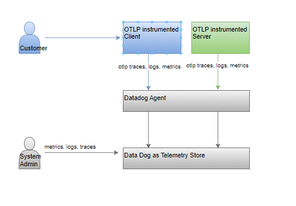
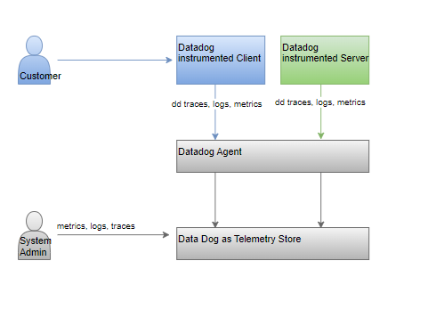

# open-telemetry-dd

## Objective
- Export logs, traces, and metrics to data dog using open telemetry protocol
- Setup and view alerts in datadog based on error counts
- Avoid using vendor specific code components within application for instrumentation
- Compare differences between using opentelemetry SDK vs using DD SDK



**Opentelemetry instrumented applications**



**Datadog instrumented applications**

## Notes
- settings > search > processors > build > annotation processing
- gradle reload for classes in red?
- gradle application
- logback jansi
- DD agent
  - Execute msi as cmd prompt admin user - start /wait msiexec /qn /i datadog-agent-7-latest.amd64.msi APIKEY="xxx" SITE="datadoghq.com"
  - user/orgsettings/apikeys
  - C:\Program Files\Datadog\Datadog Agent
- Configure DD agent
  - agent configuration file - https://docs.datadoghq.com/agent/guide/agent-configuration-files/?tab=agentv6v7
  - %ProgramData%\Datadog\datadog.yaml
- Configure application log collection
  - https://docs.datadoghq.com/logs/log_collection/java/?tab=logback
- Collecting and publishing application logs https://docs.datadoghq.com/logs/log_collection/?tab=application
  - loback and pom
- Configure agent for application logs (https://docs.datadoghq.com/logs/log_collection/java/?tab=logback#configure-the-datadog-agent)
  - https://docs.datadoghq.com/agent/basic_agent_usage/windows/?tab=gui
  - C:\Program Files\Datadog\Datadog Agent\bin>agent.exe run | stop-service | restart-service | stop-service
  - http://127.0.0.1:5002/ (agent dashboard)
- Configure application to be traced with dd agent
  - Update datadog.yaml file to send traces by setting "apm_config.enabled=true" (says optional? but connect failing)
  - Test agent status - java -jar c:/wenv/workspace/opentelemetry-dd-poc/dd-java-tracer-agent.jar sampleTrace -c 1
  - https://docs.datadoghq.com/tracing/troubleshooting/connection_errors/
  - netstat -a -n -o | grep 8126
  - restarting the agent after updating the datadog agent worked
  - https://docs.datadoghq.com/tracing/trace_collection/dd_libraries/java/?tab=springboot
  - JAVA_OPTS=-javaagent:c:/wenv/workspace/opentelemetry-dd-poc/dd-java-tracer-agent.jar or in VM opts just include the value
  - datadog.yaml > apm_config.log_file: c:/wenv/workspace/opentelemetry-dd-poc/dd-trace.log for troubleshooting
  - Process config enable process metrics logging
  - Trace api dd tracer agent:
    - https://docs.datadoghq.com/tracing/trace_collection/open_standards/java/
    - https://docs.datadoghq.com/tracing/trace_collection/custom_instrumentation/java/
    - https://opentelemetry.io/docs/instrumentation/java/manual/
  - Linking logs and traces
    - https://docs.datadoghq.com/logs/log_collection/java/?tab=logback
    - logback trace and span ids injection
  - Trace api with otel tracer agent
    - Update gradle file with otel libraries
      - https://github.com/open-telemetry/opentelemetry-java/tree/main/sdk-extensions/autoconfigure
    - Update logback for linking logs and traces (not required? no logs)
    - Update application.yml file for server port
    - Download otel java tracer agent
    - Include agent in the run command
    - Include agent debugger in the run command -Dotel.javaagent.debug=true
    - In the controller use the Span.current span to trace and log as well
    - Update datadog.yaml with otel instrumented app log files
    - otel http exporter did not work, tried using grpc port which seems to work
  - Tracing using headers
    - https://github.com/DataDog/dd-trace-java/issues/2236
    - https://vertexinc.atlassian.net/browse/SRE-500
  - Trace tags and header propagation datadog
    - https://github.com/openzipkin/b3-propagation#multiple-headers
    - https://docs.datadoghq.com/tracing/trace_collection/compatibility/java/
    - https://docs.datadoghq.com/tracing/trace_collection/library_config/java/
      - -Ddd.trace.header.tags
      - -Ddd.propagation.style.inject=Datadog,B3
      - -Ddd.propagation.style.extract=Datadog,B3
      - -Ddd.trace.header.baggage
```
-javaagent:C:\wenv\workspace\opentelemetry-dd-poc\dd-java-tracer-agent.jar
-Ddd.version=0.1
-Ddd.app=dd-client
-Ddd.service=dd-client-app
-Ddd.env=local
-Ddd.logs.injection=true
-Ddd.trace.header.tags=X-API-ddtraceid,X-API-amzntraceid,X-API-Trusted-Id,X-API-Company-Code,X-API-Request-Type,X-API-Client-Id,X-API-Client-Name,X-API-OSeries-Pod-Id
-Ddd.propagation.style.inject=datadog,b3,b3multi,xray
-Ddd.propagation.style.extract=datadog,b3,b3multi,xray
```

```
-javaagent:C:\wenv\workspace\opentelemetry-dd-poc\dd-java-tracer-agent.jar
-Ddd.version=0.1
-Ddd.app=dd-server
-Ddd.service=dd-server-app
-Ddd.env=local
-Ddd.logs.injection=true
-Ddd.trace.header.tags=X-API-ddtraceid,X-API-amzntraceid,X-API-Trusted-Id,X-API-Company-Code,X-API-Request-Type,X-API-Client-Id,X-API-Client-Name,X-API-OSeries-Pod-Id
-Ddd.propagation.style.inject=datadog,b3,b3multi,xray
-Ddd.propagation.style.extract=datadog,b3,b3multi,xray
```
  - Trace tags and header propagation with otlp
    - https://github.com/openzipkin/b3-propagation#multiple-headers

## References
- https://opentelemetry.io/docs/
- https://docs.datadoghq.com/opentelemetry/
- 