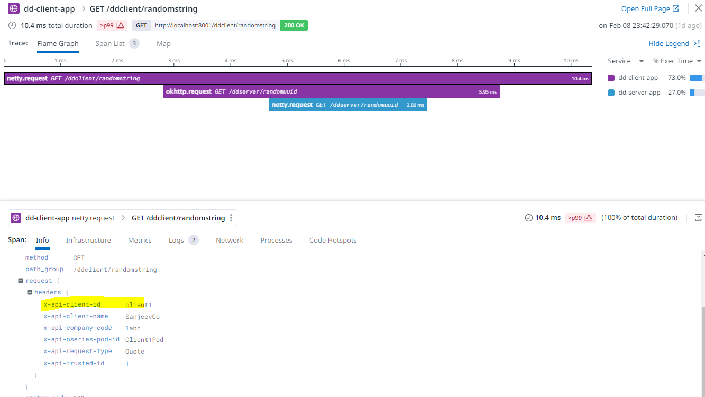
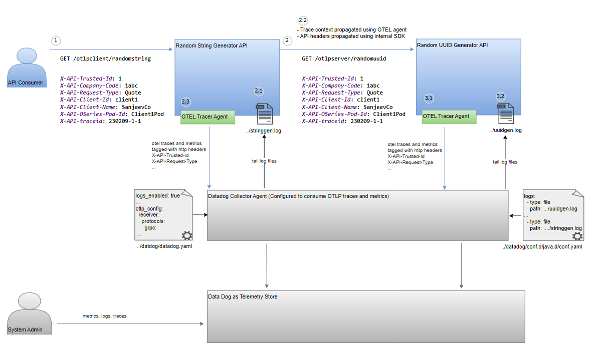
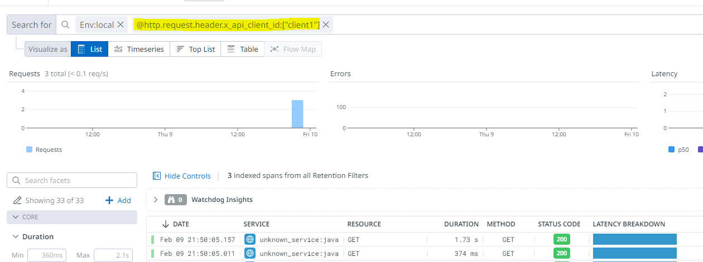

# Instrumentation with Datadog and Opentelemetry Tracer Agents

## Objective
- Export traces and metrics using native Datadog agent
- Export traces and metrics using Opentelemetry agent
- Avoid using vendor specific code components within application for instrumentation
- Compare differences between using opentelemetry SDK vs using DD SDK

### Datadog Setup
Before begining the setup, you will need to generate datadog api for the agent. On the datadog dashboard go to `user/orgsettings/apikeys`
to generate a new one or copy an existing api key.

#### Datadog Collector Agent Installation
[Download and install datadog agent](https://docs.datadoghq.com/agent/) for the desired operating system.

##### Installation Tips for Windows

- Execute msi as cmd prompt admin user - `start /wait msiexec /qn /i datadog-agent-7-latest.amd64.msi APIKEY="xxx" SITE="datadoghq.com"`

#### Datadog Collector Agent Configuration

##### Configure Datadog Collector Agent for Log Collection
Update the [datadog.yaml file](https://docs.datadoghq.com/agent/guide/agent-configuration-files/?tab=agentv6v7) to enable log collection.
```yaml
api_key: your-api-key
site: datadoghq.com
logs_enabled: true

apm_config:
  enabled: true
  log_file: /path/to/trace/log/file.log
  
process_config:
  process_collection:
    enabled: true
    
# Only required if using OTLP tracer agent instead of native datadog agent
otlp_config:
  receiver:
    protocols:
      grpc:
        endpoint: 0.0.0.0:4317
        transport: tcp
  metrics:
    enabled: true
  traces:
    enabled: true
```

####
Start datadog agent
```shell
cd /path/to/datadog/agent/bin
agent.exe start-service
```

### Instrumenting Applications using Datadog Tracer Agents


##### Configure Application Log Collection
Create ../datadog/conf.d/java.d/conf.yaml file to [configure application log file collection](https://docs.datadoghq.com/logs/log_collection/java/?tab=logback)
```yaml
#Log section
logs:

  - type: file
    path: "/path/to/logs/string-gen-api.log"
    service: dd-client
    source: java
    sourcecategory: sourcecode
  - type: file
    path: "/path/to/logs/guid-gen-api.log"
    service: dd-server
    source: java
    sourcecategory: sourcecode
```

##### Attach Datadog Tracer Agent to Target Applications
Download the [datadog tracer agent](https://dtdg.co/latest-java-tracer) and run your application with the agent attached to it.

`java -javaagent:C:\wenv\workspace\opentelemetry-dd-poc\otlp-java-tracer-agent.jar .... app.jar`

##### Configure Datadog Agent to Create Tags Using HTTP Headers
Use the configuration parameter [dd.trace.header.tags](https://docs.datadoghq.com/tracing/trace_collection/library_config/java/)
for creating dynamic tags using HTTP header entries.
```
-Ddd.trace.header.tags=X-API-Trusted-Id,X-API-Company-Code,X-API-Request-Type,X-API-Client-Id,X-API-Client-Name,X-API-OSeries-Pod-Id
```

##### Propagate Trace Context Information between Client/Server Applications
Use the [dd.propagation.style.inject](https://docs.datadoghq.com/tracing/trace_collection/library_config/java/)
configuration parameter for propagating trace context as HTTP headers between client/server transactions.
```
-Ddd.propagation.style.inject=datadog,b3,b3multi,xray
-Ddd.propagation.style.extract=datadog,b3,b3multi,xray
```

##### Propagate Application Specific Headers using Custom SDK
```kotlin
package com.codecanvas.ddclient

import ...

@Controller("/ddclient")
class DdClientController {
  private val logger = KotlinLogging.logger {}
  private val client = OkHttpClient()

  @Get("/randomstring")
  @Produces(MediaType.TEXT_PLAIN)
  fun getRandomString(headers: HttpHeaders): String {
    logger.info("Generating random string ...")

    val reqBuilder = Request.Builder().url("http://localhost:8000/ddserver/randomuuid")
    
    // *** API Specific header propagation (SDK Preferred)
    // Trace specific information (trace, span, parent) is auto propagated by agent based on config
    headers.filter { header -> header.key.startsWith("X-API-") }
      .forEach { header -> reqBuilder.addHeader(header.key, header.value.first()) }

    client.newCall(reqBuilder.build()).execute().use { response ->
      return response.body!!.string()
    }
  }

  @Get("/randomstringfailure")
  @Produces(MediaType.TEXT_PLAIN)
  fun getRandomStringFailure(headers: HttpHeaders): String {
    logger.info("Generating random error ...")

    val reqBuilder = Request.Builder().url("http://localhost:8000/ddserver/randomuuidfailure")
    
    // *** API Specific header propagation (SDK Preferred)
    // Trace specific information (trace, span, parent) is auto propagated by agent based on config
    headers.filter { header -> header.key.startsWith("X-API-") }
      .forEach { header -> reqBuilder.addHeader(header.key, header.value.first()) }

    client.newCall(reqBuilder.build()).execute().use { response ->
      return response.body!!.string()
    }
  }
}
```

##### Communicating Trace Context in Application Errors
```kotlin
package com.codecanvas.ddserver

import ...

@Produces
@Singleton
@Requirements(
    Requires(classes = [TraceableException::class, ExceptionHandler::class])
)
class TraceableExceptionHandler(private val errorResponseProcessor: ErrorResponseProcessor<Any>) :
    ExceptionHandler<TraceableException, HttpResponse<*>> {

    override fun handle(request: HttpRequest<*>, exception: TraceableException): HttpResponse<*> {
        return errorResponseProcessor.processResponse(
            ErrorContext.builder(request)
                .cause(exception)
                .errorMessage("${exception.message} " +
                        "b3 trace: ${request.headers.get("X-B3-traceid")} " +
                        "amzn trace: ${request.headers.get("x-amzn-trace-id") } " +
                        "dd trace: ${request.headers.get("x-datadog-trace-id") } ")
                .build(), HttpResponse.badRequest<Any>()
        )
    }
}

```
##### Sample Application Error Messsage
```json
{
  "message":"Bad Request",
  "_links":{"self":{"href":"/otlpserver/randomuuidfailure","templated":false}},
  "_embedded":{
    "errors":[
      {"message":"Simulated error (otlp) ... w3c traceparent: 00-dd1b14a499b5aaa117adbfda549444cd-1a67cabd64df9103-01 "}
    ]
  }
}
```

##### Complete VM Options for dd-client Application
```shell
-javaagent:C:\wenv\workspace\opentelemetry-dd-poc\dd-java-tracer-agent.jar
-Ddd.version=0.1
-Ddd.app=dd-client
-Ddd.service=dd-client-app
-Ddd.env=local
-Ddd.logs.injection=true
-Ddd.trace.header.tags=X-API-ddtraceid,X-API-amzntraceid,X-API-Trusted-Id,X-API-Company-Code,X-API-Request-Type,X-API-Client-Id,X-API-Client-Name,X-API-OSeries-Pod-Id
-Ddd.propagation.style.inject=datadog,b3,b3multi,xray
-Ddd.propagation.style.extract=datadog,b3,b3multi,xray
```

##### Complete VM Options for dd-server Application
```shell
-javaagent:C:\wenv\workspace\opentelemetry-dd-poc\dd-java-tracer-agent.jar
-Ddd.version=0.1
-Ddd.app=dd-server
-Ddd.service=dd-server-app
-Ddd.env=local
-Ddd.logs.injection=true
-Ddd.trace.header.tags=X-API-ddtraceid,X-API-amzntraceid,X-API-Trusted-Id,X-API-Company-Code,X-API-Request-Type,X-API-Client-Id,X-API-Client-Name,X-API-OSeries-Pod-Id
-Ddd.propagation.style.inject=datadog,b3,b3multi,xray
-Ddd.propagation.style.extract=datadog,b3,b3multi,xray
```

##### Sample Http Requests for DD Instrumented Applications
```
### Request for client 1
GET http://localhost:8001/ddclient/randomstring
X-API-Trusted-Id: 1
X-API-Company-Code: 1abc
X-API-Request-Type: Quote
X-API-Client-Id: client1
X-API-Client-Name: SanjeevCo
X-API-OSeries-Pod-Id: Client1Pod
X-API-traceid: 230209-1-1

### Request for client 2
GET http://localhost:8001/ddclient/randomstring
X-API-Trusted-Id: 2
X-API-Company-Code: 2abc
X-API-Request-Type: Invoice
X-API-Client-Id: client2
X-API-Client-Name: SanjeevCo2
X-API-OSeries-Pod-Id: Client2Pod
X-API-traceid: 230209-2-1

### Request for client 3 with failure
GET http://localhost:8001/ddclient/randomstringfailure
X-API-Trusted-Id: 3
X-API-Company-Code: 3abc
X-API-Request-Type: Invoice
X-API-Client-Id: client3
X-API-Client-Name: SanjeevCo3
X-API-OSeries-Pod-Id: Client3Pod
X-API-traceid: 230209-3-1
```

##### Querying Datadog Traces by Application Specific Header Values and Linking to Logs and Metrics



##### Querying Datadog Traces by Trace Ids and Linking to Logs and Metrics


### Instrumenting Applications using Opentelemetry Tracer Agents


##### Configure Application Log Collection
Create ../datadog/conf.d/java.d/conf.yaml file to [configure application log file collection](https://docs.datadoghq.com/logs/log_collection/java/?tab=logback)
```yaml
logs:
  - type: file
    path: "C:/wenv/workspace/opentelemetry-dd-poc/otlp-server/logs/otlp-server.log"
    service: otlp-server
    source: java
    sourcecategory: sourcecode
  - type: file
    path: "C:/wenv/workspace/opentelemetry-dd-poc/otlp-client/logs/otlp-client.log"
    service: otlp-client
    source: java
    sourcecategory: sourcecode  
```

##### Attach Opentelemetry Tracer Agent to Target Applications
Download the [otel tracer agent](https://github.com/open-telemetry/opentelemetry-java-instrumentation/releases/latest/download/opentelemetry-javaagent.jar) and run your application with the agent attached to it.

`java -javaagent:C:\wenv\workspace\opentelemetry-dd-poc\otlp-java-tracer-agent.jar .... app.jar`

##### Configure Opentelemetry Tracer Agent to Create Tags Using HTTP Headers
Use the configuration parameter [otel.instrumentation.http.capture-headers](https://opentelemetry.io/docs/instrumentation/java/automatic/agent-config/#capturing-http-request-and-response-headers)
for creating dynamic tags using HTTP header entries.
```
-Dotel.instrumentation.http.capture-headers.client.request=X-API-Trusted-Id,X-API-Company-Code,X-API-Request-Type,X-API-Client-Id,X-API-Client-Name,X-API-OSeries-Pod-Id,X-API-traceid
-Dotel.instrumentation.http.capture-headers.server.request=X-API-Trusted-Id,X-API-Company-Code,X-API-Request-Type,X-API-Client-Id,X-API-Client-Name,X-API-OSeries-Pod-Id,X-API-traceid
```

##### Propagate Trace Context Information between Client/Server Applications
Use the [otel.propagators](https://github.com/open-telemetry/opentelemetry-java/blob/main/sdk-extensions/autoconfigure/README.md#propagator)
configuration parameter for propagating trace context as HTTP headers between client/server transactions.
```
-Dotel.propagators=tracecontext,baggage
```

##### Propagate Application Specific Headers using Custom SDK
```kotlin
package com.codecanvas.otlpclient

import ...

@Controller("/otlpclient")
class OtlpClientController {
  private val logger = KotlinLogging.logger {}
  private val client = OkHttpClient()

  @Get("/randomstring")
  @Produces(MediaType.TEXT_PLAIN)
  fun getRandomStringOtelSdk(headers: HttpHeaders): String {
    logger.info("Generating random string (otlp) ...")

    val reqBuilder = Request.Builder().url("http://localhost:9000/otlpserver/randomuuid")
    // *** API Specific header propagation (SDK Preferred)
    // Trace specific information (trace, span, parent) is auto propagated by agent based on config
    headers.filter { header -> header.key.startsWith("X-API-") }
      .forEach { header -> reqBuilder.addHeader(header.key, header.value.first()) }

    client.newCall(reqBuilder.build()).execute().use { response ->
      return response.body!!.string()
    }
  }

  @Get("/randomstringfailure")
  @Produces(MediaType.TEXT_PLAIN)
  fun getRandomStringFailureOtelSdk(headers: HttpHeaders): String {
    logger.info("Generating random failure (otlp) ...")

    val reqBuilder = Request.Builder().url("http://localhost:9000/otlpserver/randomuuidfailure")

    // *** API Specific header propagation (SDK Preferred)
    // Trace specific information (trace, span, parent) is auto propagated by agent based on config
    headers.filter { header -> header.key.startsWith("X-API-") }
      .forEach { header -> reqBuilder.addHeader(header.key, header.value.first()) }

    client.newCall(reqBuilder.build()).execute().use { response ->
      return response.body!!.string()
    }
  }
}
```

##### Communicating Trace Context in Application Errors
```kotlin
package com.codecanvas.otlpserver

import ...

@Produces
@Singleton
@Requirements(
  Requires(classes = [TraceableException::class, ExceptionHandler::class])
)
class TraceableExceptionHandler(private val errorResponseProcessor: ErrorResponseProcessor<Any>) :
  ExceptionHandler<TraceableException, HttpResponse<*>> {

  override fun handle(request: HttpRequest<*>, exception: TraceableException): HttpResponse<*> {
    return errorResponseProcessor.processResponse(
      ErrorContext.builder(request)
        .cause(exception)
        .errorMessage("${exception.message} w3c traceparent: ${request.headers.get("traceparent")} ")
        .build(), HttpResponse.badRequest<Any>()
    )
  }

}
```
##### Sample Application Error Messsage
```json
{
  "message":"Bad Request",
  "_links":{
    "self":{"href":"/ddserver/randomuuidfailure","templated":false}
  },
  "_embedded":{
    "errors":[
      {"message":"Simulated error b3 trace: 36ae0f3d27080d22amzn trace: Root=1-63e476f9-0000000036ae0f3d27080d22;Parent=0eea0234a160100c;Sampled=1dd trace: 3940103479318023458"}
    ]
  }}
```

##### Complete VM Options for otlp-client Application
```shell
-javaagent:C:\wenv\workspace\opentelemetry-dd-poc\otlp-java-tracer-agent.jar
-Dotel.javaagent.debug=true
-Dotel.resource.attributes=api.version=0.1,api.id=otlp-client,api.service=otlp-client-app,api.env=local
-Dotel.exporter.otlp.headers="X-API-Trusted-Id=api_tid,X-API-Company-Code=api_cmpycd,X-API-Request-Type=api_reqtp,X-API-Client-Id=api_clienti,X-API-Client-Name=api_clientnm,X-API-OSeries-Pod-Id=api_podid,X-API-traceid=api_traceid"
-Dotel.instrumentation.http.capture-headers.client.request=X-API-Trusted-Id,X-API-Company-Code,X-API-Request-Type,X-API-Client-Id,X-API-Client-Name,X-API-OSeries-Pod-Id,X-API-traceid
-Dotel.instrumentation.http.capture-headers.server.request=X-API-Trusted-Id,X-API-Company-Code,X-API-Request-Type,X-API-Client-Id,X-API-Client-Name,X-API-OSeries-Pod-Id,X-API-traceid
-Dotel.propagators=tracecontext,baggage
-Dotel.exporter.otlp.endpoint=http://localhost:4317
```

##### Complete VM Options for otlp-server Application
```shell
-javaagent:C:\wenv\workspace\opentelemetry-dd-poc\otlp-java-tracer-agent.jar
-Dotel.javaagent.debug=true
-Dotel.resource.attributes=api.version=0.1,api.id=otlp-server,api.service=otlp-server-app,api.env=local
-Dotel.exporter.otlp.headers="X-API-Trusted-Id=api_tid,X-API-Company-Code=api_cmpycd,X-API-Request-Type=api_reqtp,X-API-Client-Id=api_clienti,X-API-Client-Name=api_clientnm,X-API-OSeries-Pod-Id=api_podid,X-API-traceid=api_traceid"
-Dotel.instrumentation.http.capture-headers.client.request=X-API-Trusted-Id,X-API-Company-Code,X-API-Request-Type,X-API-Client-Id,X-API-Client-Name,X-API-OSeries-Pod-Id,X-API-traceid
-Dotel.instrumentation.http.capture-headers.server.request=X-API-Trusted-Id,X-API-Company-Code,X-API-Request-Type,X-API-Client-Id,X-API-Client-Name,X-API-OSeries-Pod-Id,X-API-traceid
-Dotel.propagators=tracecontext,baggage
-Dotel.exporter.otlp.endpoint=http://localhost:4317
```

##### Sample Http Requests
```
### Request for client 1
GET http://localhost:9001/otlpclient/randomstring
X-API-Trusted-Id: 1
X-API-Company-Code: 1abc
X-API-Request-Type: Quote
X-API-Client-Id: client1
X-API-Client-Name: SanjeevCo
X-API-OSeries-Pod-Id: Client1Pod
X-API-traceid: 230209-1-1

### Request for client 2
GET http://localhost:9001/otlpclient/randomstring
X-API-Trusted-Id: 2
X-API-Company-Code: 2abc
X-API-Request-Type: Invoice
X-API-Client-Id: client2
X-API-Client-Name: SanjeevCo2
X-API-OSeries-Pod-Id: Client2Pod
X-API-traceid: 230209-2-1

### Request for client 3 with failure
GET http://localhost:9001/otlpclient/randomstringfailure
X-API-Trusted-Id: 3
X-API-Company-Code: 3abc
X-API-Request-Type: Invoice
X-API-Client-Id: client3
X-API-Client-Name: SanjeevCo3
X-API-OSeries-Pod-Id: Client3Pod
X-API-traceid: 230209-3-1
```

##### Querying Traces by Application Specific Header Values and Linking to Logs and Metrics


##### Querying Traces by Trace Ids and Linking to Logs and Metrics


## Conclusion

- Both OTEL and DD trace agents do not require application to be aware of the underlying telemetry store
- Using DD trace agent seems to offer better user experience in terms linking logs, metrics, and traces
- Both OTEL and DD traces can be declaratively configured to generate tags
- At this time, I would prefer DD trace agent over OTEL due to easier linking of traces, logs, and metrics.


## Notes
- settings > search > processors > build > annotation processing
- gradle reload for classes in red?
- gradle application
- logback jansi
- DD agent
  - Execute msi as cmd prompt admin user - start /wait msiexec /qn /i datadog-agent-7-latest.amd64.msi APIKEY="xxx" SITE="datadoghq.com"
  - user/orgsettings/apikeys
  - C:\Program Files\Datadog\Datadog Agent
- Configure DD agent
  - agent configuration file - https://docs.datadoghq.com/agent/guide/agent-configuration-files/?tab=agentv6v7
  - %ProgramData%\Datadog\datadog.yaml
- Configure application log collection
  - https://docs.datadoghq.com/logs/log_collection/java/?tab=logback
- Collecting and publishing application logs https://docs.datadoghq.com/logs/log_collection/?tab=application
  - loback and pom
- Configure agent for application logs (https://docs.datadoghq.com/logs/log_collection/java/?tab=logback#configure-the-datadog-agent)
  - https://docs.datadoghq.com/agent/basic_agent_usage/windows/?tab=gui
  - C:\Program Files\Datadog\Datadog Agent\bin>agent.exe run | stop-service | restart-service | stop-service
  - http://127.0.0.1:5002/ (agent dashboard)
- Configure application to be traced with dd agent
  - Update datadog.yaml file to send traces by setting "apm_config.enabled=true" (says optional? but connect failing)
  - Test agent status - java -jar c:/wenv/workspace/opentelemetry-dd-poc/dd-java-tracer-agent.jar sampleTrace -c 1
  - https://docs.datadoghq.com/tracing/troubleshooting/connection_errors/
  - netstat -a -n -o | grep 8126
  - restarting the agent after updating the datadog agent worked
  - https://docs.datadoghq.com/tracing/trace_collection/dd_libraries/java/?tab=springboot
  - JAVA_OPTS=-javaagent:c:/wenv/workspace/opentelemetry-dd-poc/dd-java-tracer-agent.jar or in VM opts just include the value
  - datadog.yaml > apm_config.log_file: c:/wenv/workspace/opentelemetry-dd-poc/dd-trace.log for troubleshooting
  - Process config enable process metrics logging
  - Trace api dd tracer agent:
    - https://docs.datadoghq.com/tracing/trace_collection/open_standards/java/
    - https://docs.datadoghq.com/tracing/trace_collection/custom_instrumentation/java/
    - https://opentelemetry.io/docs/instrumentation/java/manual/
  - Linking logs and traces
    - https://docs.datadoghq.com/logs/log_collection/java/?tab=logback
    - logback trace and span ids injection
  - Trace api with otel tracer agent
    - https://opentelemetry.io/docs/instrumentation/java/automatic/agent-config/ 
    - Update gradle file with otel libraries
      - https://github.com/open-telemetry/opentelemetry-java/tree/main/sdk-extensions/autoconfigure
    - Update logback for linking logs and traces (not required? no logs)
    - Update application.yml file for server port
    - Download otel java tracer agent
    - Include agent in the run command
    - Include agent debugger in the run command -Dotel.javaagent.debug=true
    - In the controller use the Span.current span to trace and log as well
    - Update datadog.yaml with otel instrumented app log files
    - otel http exporter did not work, tried using grpc port which seems to work
  - Tracing using headers
    - https://github.com/DataDog/dd-trace-java/issues/2236
    - https://vertexinc.atlassian.net/browse/SRE-500
  - Trace tags and header propagation datadog
    - https://github.com/openzipkin/b3-propagation#multiple-headers
    - https://docs.datadoghq.com/tracing/trace_collection/compatibility/java/
    - https://docs.datadoghq.com/tracing/trace_collection/library_config/java/
      - -Ddd.trace.header.tags
      - -Ddd.propagation.style.inject=Datadog,B3
      - -Ddd.propagation.style.extract=Datadog,B3
      - -Ddd.trace.header.baggage

  - Trace tags and header propagation with otlp
    - https://github.com/openzipkin/b3-propagation#multiple-headers

## References
- https://opentelemetry.io/docs/
- https://docs.datadoghq.com/opentelemetry/